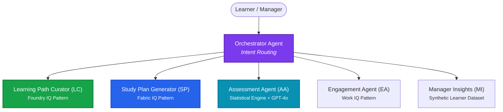

# StochastiQ 🎲

**Enterprise Certification for Probabilistic Reasoning Competency**

[](#)
[](#)
[](#)
[](#)

> AI that reasons through stochastic problems alongside your team — not just at them.

---

## What is StochastiQ?

StochastiQ is a multi-agent enterprise certification system that verifies data scientists and researchers actually understand the probabilistic models they use — not just the tools. 

Built for the **Microsoft Agents League Hackathon — Reasoning Agents Track**, StochastiQ addresses a critical gap: organizations frequently certify teams on software tools and APIs, but rarely on the foundational statistical and probabilistic theory required to apply them correctly.

---

## The Problem

A data scientist can easily be certified on Python, SQL, or Azure — but:
- Can they identify whether a real-world stochastic process is memoryless?
- Can they detect a heavy-tailed distribution and explain why a standard Poisson model fails?
- Can they mathematically justify switching to a compound process?

These theoretical foundations determine whether probabilistic models are applied correctly or fail catastrophically in production. **StochastiQ certifies exactly this.**

---

## Multi-Agent Architecture

StochastiQ uses a modular multi-agent system to handle routing, learning path curation, personalized reminders, and deep statistical reasoning.



### Agent Roles and Grounding

| Agent | Role | Grounding Layer |
| :--- | :--- | :--- |
| **Learning Path Curator (LC)** | Recommends the next learning module based on user's role and history. | **Knowledge Base**: Grounded on Sheldon Ross's *Introduction to Probability Models* excerpts. |
| **Study Plan Generator (SP)** | Builds a capacity-aware study schedule for the learner. | **Fabric IQ Pattern**: Semantic mapping of roles, modules, and prerequisites. |
| **Assessment Agent (AA)** | Reasons step-by-step through complex stochastic problems. | **Statistical Engine**: Executed against actual tests (KS, chi-square) + GPT-4o. |
| **Engagement Agent (EA)** | Personalizes study reminders based on work context. | **Work IQ Pattern**: Real-time signals from meeting calendars and focus hour slots. |
| **Manager Insights (MI)** | Summarizes team readiness, skill gaps, and risk flags. | **Synthetic Datasets**: Aggregated assessment analytics for management. |

---

## The Assessment Agent — Core Innovation

Unlike simple quiz applications, the **Assessment Agent** does not just grade answers; it follows a rigorous 5-step reasoning protocol grounded in statistical reality:

```
[STEP 1 — EXPLORE]     📊 Calculate descriptive statistics, check variance-to-mean ratio (VMR), evaluate tail behavior.
[STEP 2 — HYPOTHESIZE] 💡 Propose 2 candidate models with rigorous mathematical justification.
[STEP 3 — TEST]        🧪 Run goodness-of-fit statistical tests (e.g., Kolmogorov-Smirnov, Chi-Square).
[STEP 4 — REFLECT]     🧐 Critique the models, reject candidates with explicit mathematical reasoning.
[STEP 5 — CONCLUDE]    🏆 Select best-fit model, solve for parameters, and estimate extreme-event probabilities.
```

Every response is grounded in Ross's *Introduction to Probability Models* and evaluated against a live statistical engine — **no hallucinated test results.**

### Example: Ambiguous Mixed Process

When a learner submits complex burst data that violates simple assumptions:
1. **Poisson Model Fails:** The engine computes $\text{VMR} = 9.78$, proving equidispersion is severely violated.
2. **Negative Binomial Fails:** The extreme kurtosis ($\text{Kurt} = 24.27$) exceeds the model's analytical threshold.
3. **Agent Action:** Correctly identifies a compound **Poisson-Gamma** process, cites Ross Chapter 6 on compound distributions, and suggests AIC/BIC model selection criteria as the next diagnostic step.

---

## Microsoft IQ Integration

We leverage three key design patterns from Microsoft IQ to build a cohesive enterprise agent system:

| Layer | Design Pattern | Implementation Detail |
| :--- | :--- | :--- |
| **Foundry IQ** | *Knowledge Base Integration* | Grounding of the **Learning Path Curator** and **Assessment Agent** using curated Ross textbook excerpts and the official certification syllabus. |
| **Fabric IQ** | *Semantic Data Access* | Semantic mapping of learner roles to certification requirements, automatically checking module prerequisites and performance thresholds. |
| **Work IQ** | *Work Context Integration* | Extraction of workplace metrics (meeting hours, focus blocks, and preferred study times) to optimize reminder delivery via the **Engagement Agent**. |

---

## Tech Stack

- **Agent Orchestration:** Microsoft Agent Framework (Local implementation)
- **Large Language Model:** GitHub-hosted `gpt-4o` via GitHub Models
- **Statistical Engine:** Python (`scipy`, `numpy`, `statsmodels`)
- **User Interface:** Streamlit (Clean, dark-themed dashboard)
- **Version Control:** Git & GitHub

> [!NOTE]
> **Deployment Architecture:** The code is designed for the **Foundry Agent Service** (Hosted Agents). While this hackathon repository runs locally, the production path deploys via Azure Container Registry (ACR) to the Foundry Agent Service.

---

## Certification Curriculum

| Module | Topic | Textbook Reference (Ross) | Passing Threshold |
| :---: | :--- | :--- | :---: |
| **1** | Discrete Random Variables | Chapter 2 | 75% |
| **2** | Conditional Probability & Bayes | Chapter 3 | 75% |
| **3** | Poisson Process | Chapter 5 | 80% |
| **4** | Markov Chains | Chapter 4 | 80% |
| **5** | Heavy-Tailed Distributions | Chapters 2 & 6 | 85% |

---

## Assessment Scenarios

Learners are tested on real-time simulated processes:

| Scenario | Process Type | Primary Statistical Test | Expected Analysis Outcome |
| :--- | :--- | :--- | :--- |
| **Poisson** | Laser photon counts | Chi-Square Goodness-of-Fit | Confirms $\text{VMR} \approx 1$, estimates rate parameter $\lambda$. |
| **Lévy** | Burst intensity fluctuations | Kolmogorov-Smirnov (KS) | Heavy tail confirmed; quantifies extreme tail-event probability. |
| **Exponential** | Inter-arrival times | Kolmogorov-Smirnov (KS) | Evaluates memoryless property and arrival rate. |
| **Ambiguous** | Unknown mixed process | Multiple tests | Rejects simple models $\rightarrow$ argues for compound Poisson-Gamma. |

---

## Project Structure

```
stochastiQ/
├── agents/
│   ├── orchestrator.py        # Orchestrates and routes user intent
│   ├── assessment_agent.py    # Core 5-step reasoning agent
│   └── supporting_agents.py   # LC, SP, EA, and MI agents
├── tools/
│   └── statistical_engine.py  # SciPy & Statsmodels calculation engine
├── knowledge_base/            # Textbook chapters & syllabus guidelines
├── synthetic_data/            # Synthetic learner records & logs
├── assets/
│   └── stochastiq_banner.png  # Project banner image
├── app.py                     # Streamlit web application
├── requirements.txt           # Python package dependencies
├── .env.example               # Template for environment variables
└── README.md                  # Project documentation (this file)
```

---

## Setup & Local Installation

### Prerequisites
- Python 3.10 or 3.11
- A GitHub Personal Access Token (with access to GitHub Models)

### Installation Steps

1. **Clone the Repository:**
   ```bash
   git clone https://github.com/rafifernandaa/stochastiQ.git
   cd stochastiQ
   ```

2. **Set Up a Virtual Environment:**
   ```bash
   python -m venv .venv
   # Activate on Windows:
   .venv\Scripts\activate
   # Activate on macOS/Linux:
   source .venv/bin/activate
   ```

3. **Install Dependencies:**
   ```bash
   pip install -r requirements.txt
   ```

4. **Configure Environment Variables:**
   ```bash
   cp .env.example .env
   ```
   Open the `.env` file and replace `your_github_personal_access_token_here` with your actual GitHub token.

5. **Run the Streamlit Dashboard:**
   ```bash
   streamlit run app.py
   ```

---

## Environment Variables

The application requires the following environment configurations in your `.env` file:

```bash
# GitHub personal access token for model access
GITHUB_TOKEN=your_github_personal_access_token_here

# LLM model identifier
AZURE_AI_MODEL_DEPLOYMENT=gpt-4o
```

---

## Responsible AI & Data Transparency

- **Synthetic Data Only:** All user profiles, learning statistics, and process streams in this project are programmatically generated. No real employee data or PII is used.
- **Transparency:** The Assessment Agent's reasoning trace is fully visible to the user at run-time, allowing auditability of its intermediate calculations.
- **Grounded Outputs:** The statistical conclusions (parameters, test statistics, p-values) are computed using scipy/numpy, not LLM guesses.
- **Honest Failures:** The agent reports goodness-of-fit model rejections transparently rather than forcing a fit.

---

## License

This project is licensed under the **MIT License** - see the LICENSE file for details.
